Projeto desenvolvido nas aulas de Programação Orientada a Objetos II, no curso de formação em Java ADA B3+ Inclua.
# Biblioteca
O projeto simula um programa de gerenciamento de biblioteca que oferece serviços virtuais e no ambiente físico.

## Diagrama do projeto

```mermaid
classDiagram

namespace service{
    class BibliotecaService
    class BibliotecaServiceImpl
    class BibliotecaServiceFisica
    class BibliotecaServiceVirtual
    class BibliotecaServiceFisicaImpl
    class BibliotecaServiceVirtualImpl
}

namespace persistence{
    class BibliotecaRepositorio
    class  BibliotecaRepositorioListImpl
}

namespace model{
    class ItemCatalogo
    class Livro
    class Revista
    class Manuscrito
}

<<Interface>>BibliotecaService
BibliotecaService: +setCatalogo(BibliotecaRepositorio catalogo)
BibliotecaService: + reservar(ItemCatalogo item)
BibliotecaService: + consultarItem(ItemCatalogo item)
BibliotecaService: + consultarAutor(String autor)
BibliotecaService: + consultarTitulo(String titulo)
BibliotecaService <|-- BibliotecaServiceFisica
BibliotecaService <|-- BibliotecaServiceVirtual

<<Interface>>BibliotecaServiceFisica
BibliotecaServiceFisica: + emprestar(ItemCatalogo item)
BibliotecaServiceFisica: + devolver(ItemCatalogo item)
BibliotecaServiceFisica: + cadastrar(ItemCatalogo)

BibliotecaServiceFisica ..|> BibliotecaServiceFisicaImpl
BibliotecaServiceFisicaImpl: + reservar(ItemCatalogo item)
BibliotecaServiceFisicaImpl: + emprestar(ItemCatalogo item)
BibliotecaServiceFisicaImpl: + devolver(ItemCatalogo item)
BibliotecaServiceFisicaImpl: + consultarItem(ItemCatalogo item)
BibliotecaServiceFisicaImpl: + consultarAutor(String autor)
BibliotecaServiceFisicaImpl: + consultarTitulo(String titulo)
BibliotecaServiceFisicaImpl: + cadastrar(ItemCatalogo)
BibliotecaServiceFisicaImpl: - BibliotecaRepositorio catalogo

<<Abstract>>BibliotecaServiceImpl
BibliotecaService ..|> BibliotecaServiceImpl
BibliotecaServiceImpl <|-- BibliotecaServiceFisicaImpl
BibliotecaServiceImpl <|-- BibliotecaServiceVirtualImpl
BibliotecaServiceImpl: # BibliotecaRepositorio catalogo
BibliotecaServiceImpl: +setCatalogo(BibliotecaRepositorio catalogo)
BibliotecaServiceImpl: + reservar(ItemCatalogo item)
BibliotecaServiceImpl: + consultarItem(ItemCatalogo item)
BibliotecaServiceImpl: + consultarAutor(String autor)
BibliotecaServiceImpl: + consultarTitulo(String titulo)

<<Interface>>BibliotecaServiceVirtual

BibliotecaServiceVirtual ..|> BibliotecaServiceVirtualImpl
BibliotecaServiceVirtualImpl: - BibliotecaRepositorio catalogo
BibliotecaServiceVirtualImpl: + reservar(ItemCatalogo item)
BibliotecaServiceVirtualImpl: + consultarItem(ItemCatalogo item)
BibliotecaServiceVirtualImpl: + consultarAutor(String autor)
BibliotecaServiceVirtualImpl: + consultarTitulo(String titulo)

<<Abstract>>ItemCatalogo
ItemCatalogo: - String titulo
ItemCatalogo: - String autor
ItemCatalogo: - LocalDate data
ItemCatalogo: - boolean reservado
ItemCatalogo: - boolean emprestado
ItemCatalogo: + isReservado() boolean reservado
ItemCatalogo: + setReservado(boolean reservado)
ItemCatalogo: + isEmprestado() boolean emprestado
ItemCatalogo: + setEmprestado(boolean emprestado)
ItemCatalogo: +getTitulo() String titulo
ItemCatalogo: +getAutor() String autor
ItemCatalogo: +getData() LocalDate data
ItemCatalogo <|-- Livro
ItemCatalogo <|-- Revista
ItemCatalogo <|-- Manuscrito

<<Interface>> BibliotecaRepositorio
BibliotecaRepositorio: + salvar(ItemCatalogo)
BibliotecaRepositorio: +getCatalogo() List<ItemCatalogo>

BibliotecaRepositorio ..|> BibliotecaRepositorioListImpl
BibliotecaRepositorioListImpl: - List<ItemCatalogo> catalogo
BibliotecaRepositorioListImpl: + salvar(ItemCatalogo)
BibliotecaRepositorioListImpl: +getCatalogo() List<ItemCatalogo>

class Livro{
    -String isbn
    -String editora
    -String numeroPaginas
    + getIsbn() String isbn
    + getEditora() String editora
    + getPaginas() int numeroPaginas
}

class Revista{
    -int numeroEdicao
    -String mesPublicacao
    -String categoria
    + getEdicao() int numeroEdicao
    + getMes() String mesPublicacao
    + getCategoria() String categoria
}

class Manuscrito{
    -String localOrigem
    -String estadoConservacao
    -boolean digitalizado
    + getLocal() String localOrigem
    + getConservacao() String estadoConservacao
    + getDigitalizado() boolean digitalizado
}
```

## Processos - Swimlane

