Projetos desenvolvidos nas aulas de Programação Orientada a Objetos II, no curso de formação em Java ADA B3+ Inclua.

# Comparadores
src/main/java/comparator

Exercícios com comparable e comparator.

# Biblioteca (em andamento)
src/main/java/biblioteca

O projeto simula um programa de gerenciamento de biblioteca que oferece serviços virtuais e no ambiente físico.

## Usage
Em construção.

## Diagrama de classes (Planejamento)

```mermaid
classDiagram

class Main

namespace view{
    class ItemView
    class PessoaView
    class OperacaoView
}

namespace controller{
    class ValidacaoEntrada
    class Menu
}

class Menu{
    pesquisarObra
    pesquisarAutor
    cadastrarObra - ok
    cadastrarAssociado
    reservar
    cancelarReserva
    emprestar
    devolver
    pagarMulta
}

namespace service{
    class BibliotecaService
    class BibliotecaServiceImpl
    class BibliotecaServiceFisica
    class BibliotecaServiceVirtual
    class BibliotecaServiceFisicaImpl
    class BibliotecaServiceVirtualImpl
}

namespace model{
    class ItemCatalogo
    class Livro
    class Revista
    class Manuscrito
    class Secao
    class Pessoa
    class Autor
    class Associado
}

namespace operacoes{
    class Operacao
    class Reserva
    class Emprestimo
    class Multa
    class PagamentoMulta
    class Devolucao
}

namespace persistence{
    class BibliotecaRepositorio
    class  BibliotecaRepositorioListImpl
}

<<Interface>>BibliotecaService
BibliotecaService: +setCatalogo(BibliotecaRepositorio catalogo)
BibliotecaService: + reservar(ItemCatalogo item)
BibliotecaService: + cancelarReserva(Reserva)
BibliotecaService: + pesquisarObra(String titulo) List ItemCatalogo
BibliotecaService: + pesquisarAutor(String nomeAutor) List Autor
BibliotecaService: + pesquisarAssociado(String nomeAssociado) List Associado
BibliotecaService <|-- BibliotecaServiceFisica
BibliotecaService <|-- BibliotecaServiceVirtual

<<Interface>>BibliotecaServiceFisica
BibliotecaServiceFisica: + emprestar(ItemCatalogo item)
BibliotecaServiceFisica: + devolver(ItemCatalogo item)
BibliotecaServiceFisica: + cadastrar(ItemCatalogo)
BibliotecaServiceFisica: + cadastrar(Associado)
BibliotecaServiceFisica: + pagarMulta(Multa)

BibliotecaServiceFisica ..|> BibliotecaServiceFisicaImpl
BibliotecaServiceFisicaImpl: - BibliotecaRepositorio catalogo
BibliotecaServiceFisicaImpl: + emprestar(ItemCatalogo item)
BibliotecaServiceFisicaImpl: + devolver(ItemCatalogo item)
BibliotecaServiceFisicaImpl: + cadastrar(ItemCatalogo)
BibliotecaServiceFisicaImpl: + cadastrar(Associado)
BibliotecaServiceFisicaImpl: + pagarMulta(Multa)

<<Abstract>>BibliotecaServiceImpl
BibliotecaService ..|> BibliotecaServiceImpl
BibliotecaServiceImpl <|-- BibliotecaServiceFisicaImpl
BibliotecaServiceImpl <|-- BibliotecaServiceVirtualImpl
BibliotecaServiceImpl: # BibliotecaRepositorio catalogo
BibliotecaServiceImpl: +setCatalogo(BibliotecaRepositorio catalogo)
BibliotecaServiceImpl: + reservar(ItemCatalogo item)
BibliotecaServiceImpl: + cancelarReserva(Reserva)
BibliotecaServiceImpl: + pesquisarObra(String titulo) List ItemCatalogo
BibliotecaServiceImpl: + pesquisarAutor(String nomeAutor) List Autor
BibliotecaServiceImpl: + pesquisarAssociado(String nomeAssociado) List Associado

<<Interface>>BibliotecaServiceVirtual

BibliotecaServiceVirtual ..|> BibliotecaServiceVirtualImpl
BibliotecaServiceVirtualImpl: - BibliotecaRepositorio catalogo

<<Abstract>>ItemCatalogo
ItemCatalogo: - String titulo
ItemCatalogo: - Autor autor
ItemCatalogo: - Secao secao
ItemCatalogo: - Reserva reservaAtiva
ItemCatalogo: - Emprestimo emprestimo
ItemCatalogo: - List historico
ItemCatalogo: + getReserva() Reserva
ItemCatalogo: + setReservado(Reserva)
ItemCatalogo: + setEmprestado(Emprestimo)
ItemCatalogo: + getEmprestimo() Emprestimo
ItemCatalogo: +getTitulo() String titulo
ItemCatalogo: +getAutor() Autor autor
ItemCatalogo: + getSecao() Secao
ItemCatalogo: + setSecao(Secao)
ItemCatalogo: + equals(Object obj) boolean
ItemCatalogo: + compareTo(ItemCatalogo item) int
ItemCatalogo <|-- Livro
ItemCatalogo <|-- Revista
ItemCatalogo <|-- Manuscrito

<<Interface>> BibliotecaRepositorio
BibliotecaRepositorio: + salvar(ItemCatalogo)
BibliotecaRepositorio: + addAutor(Autor)
BibliotecaRepositorio: + cadastrarAssociado(Associado)
BibliotecaRepositorio: + consultar(Associado) boolean
BibliotecaRepositorio: + consultar(Autor) boolean
BibliotecaRepositorio: + consultar(ItemCatalogo) boolean
BibliotecaRepositorio: +getCatalogo() List<ItemCatalogo>
BibliotecaRepositorio: + getAutores() List<Autores>
BibliotecaRepositorio: +getAssociados() List<Associado>

BibliotecaRepositorio ..|> BibliotecaRepositorioListImpl
BibliotecaRepositorioListImpl: - List<ItemCatalogo> catalogo
BibliotecaRepositorioListImpl: - List<Autor> Autores
BibliotecaRepositorioListImpl: - List<Associado> associados
BibliotecaRepositorioListImpl: + salvar(ItemCatalogo item)
BibliotecaRepositorioListImpl: + addAutor(Autor autor)
BibliotecaRepositorioListImpl: + cadastrarAssociado(Associado associado)
BibliotecaRepositorioListImpl: + consultar(Associado associado) boolean
BibliotecaRepositorioListImpl: + consultar(Autor autor) boolean
BibliotecaRepositorioListImpl: + consultar(ItemCatalogo item) boolean
BibliotecaRepositorioListImpl: +getCatalogo() List<ItemCatalogo>
BibliotecaRepositorioListImpl: + getAutores() List<Autores>
BibliotecaRepositorioListImpl: +getAssociados() List<Associado>


class Livro{
    -String isbn
    -String editora
    -String numeroPaginas
    + getIsbn() String isbn
    + getEditora() String editora
    + getPaginas() int numeroPaginas
}

class Revista{
    -int numeroEdicao
    -String mesPublicacao
    -String categoria
    + construtor com Secao.REVISTAS
    + getEdicao() int numeroEdicao
    + getMes() String mesPublicacao
    + getCategoria() String categoria
}

class Manuscrito{
    -String localOrigem
    -String estadoConservacao
    -boolean digitalizado
    + construtor com Secao.MANUSCRITOS
    + getLocal() String localOrigem
    + getConservacao() String estadoConservacao
    + getDigitalizado() boolean digitalizado
}

<<Enumerate>> Secao
class Secao{
    Artes e Cultura 
    Autoajuda e Desenvolvimento Pessoal 
    Biografias e Autobiografias 
    Ciências Naturais 
    Ciências Sociais 
    Esportes e Lazer 
    Ficção Científica e Fantasia 
    Gastronomia 
    História 
    Literatura Infantil 
    Literatura Juvenil
    Manuscritos 
    Poesia 
    Religião e Espiritualidade
    Revistas 
    Romance
    Tecnologia e Ciências Aplicadas
}

<<Abstract>> Pessoa
Pessoa: - String nome
Pessoa: - String dataNascimento
Pessoa: + getNome() String
Pessoa: + getDataNascimento() String
Pessoa: + equals(Pessoa) boolean
Pessoa: + compareTo(Pessoa) int
Pessoa <|-- Autor
Pessoa <|-- Associado

class Autor{
    - String biografia
    - List<ItemCatalogo> obras
    + addObra(ItemCatalogo)
    + getObras() List
    + getNome() String
    + setBiografia(String)
}

class Associado{
    - LocalDate dataDeCadastro
    - List historico
    - Emprestimo emprestimoAtivo
    - Reserva reservaAtiva
    - Multa multaPendente
    + addOperacao()
    + getDataCadastro()
    + getHistorico()
    + getEmprestioAtivo()
    + getReservaAtiva()
    + getMultaPendente()
    + setEmprestioAtivo()
    + setReservaAtiva()
    + setMultaPendente()
}

<<Abstract>> Operacao
Operacao <|-- Emprestimo
Operacao <|-- Devolucao
Emprestimo *-- Devolucao
Emprestimo o-- Multa
Operacao <|-- Multa
Multa *-- PagamentoMulta
Operacao <|-- PagamentoMulta
Operacao <|-- Reserva
Reserva <-- Multa



class Operacao{
    - Associado associado
    - ItemCatalogo item
    - LocalDateTime dataRealizada
    + Operacao(Associado, ItemCatalogo)
    + Operacao(Associado)
    # setDataRealizada(LocalDateTime)
    + getDataRealizada() LocalDateTime
}

class Multa{
    - double valorTotal
    - boolean ativa
    - PagamentoMulta pagamento
    + setAtiva(boolean)
    + getAtiva() boolean
    + setPagamento(PagamentoMulta) setAtiva(false) 
    - calcularTotal()
    + getValorTotal() double
}


class Emprestimo{
    - boolean ativo
    - Devolucao devolucao
    - LocalDateTime vencimento
    - setAtivo(boolean)
    + isAtivo() boolean
    + setDevolucao(Devolucao) setAtivo(false)
    + getVencimento() LocalDateTime
}

class Reserva{
    - boolean ativa
    + setAtiva(boolean)
    + getAtiva() boolean
    + Reserva() setAtiva(true)
}

class Devolucao{
    + construtor(Item, Associado)
    }

class PagamentoMulta{
    - Multa multa
    - Double valor
    + PagamentoMulta(Associado, Multa) 
    + getValor() double valor
}
```

## Processos - Swimlane
Em construção.
### Cadastro de itens

#### Método BibliotecaServiceFisicaImpl.cadastrar(item)

