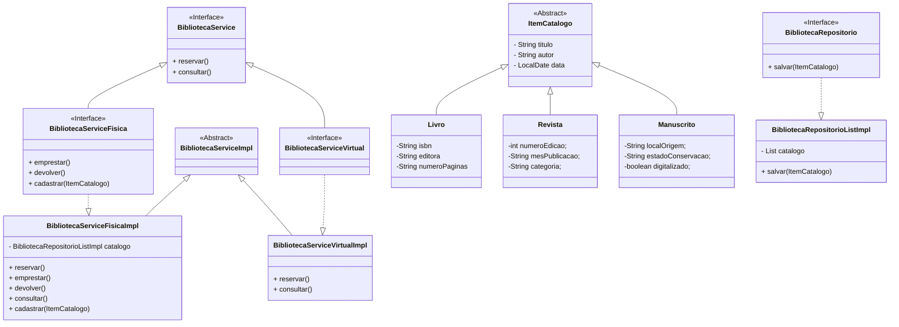

## Biblioteca 
Projeto desenvolvido nas aulas de Programação Orientada a Objetos II, no curso de formação em Java ADA B3+ Inclua.
O projeto simula um programa de gerenciamento de biblioteca que oferece serviços virtuais e no ambiente físico.

## Diagrama do projeto

